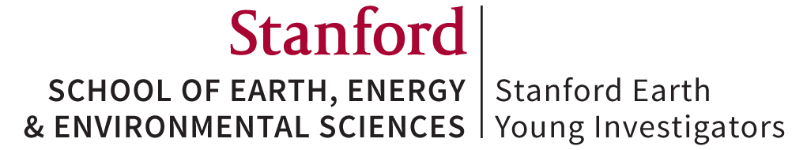

---
# 2018 Biodiversity Internship
This respository contains information for 2018 [SEYI: Biodiversity](http://historyoflife.stanford.edu/) high school internship program.

* [2018 Interns & their blogs](#interns-blogs)
* [Important Dates](#important-dates)
* [Lab Exercises](#lab-exercises)
* [R Exercises](#r-exercises)
* [Special Presentations](#special-presentations)
* [Reading & Discussion](#reading-discussion)
* [Resources](#resources) 

## 2018 SEYI:Biodiversity Interns
(links to blogs will be poste by 05 July 2018)

Intern | High School
------ | -----------
Ameya Patkar | Lynbrook High School, San Jose
Ashli Jain | Menlo School, Atherton
Christopher Noll | San Mateo High School, San Mateo
Isabella Villante | Capuchino High School, San Bruno
Loc Buu | Yerba Buena High School, San Jose
Noah Rizk | Monta Vista High School, Cupertino
Saket Bakshi | Leigh High School, San Jose
Shannon Heh | Lynbrook High School, San Jose
Sriram Sundararajan | Saint Francis High School, Mountain View
Stephanie Chen | Balboa High School, San Francisco

## Important Dates
Unless otherwise noted, the internship meets every Monday, Tuesday, & Thursday from 9 AM until 4 PM.
We meet in GeoCorner 220 on the campus of Stanford University.

Date | Trip/Due Date
---- | -----
19 June 2018 | Orientation
21 June 2018 | First full day of internship
03 July 2018 | <ul><li>Field trip to New Brighton State Beach ***Meet @ 8 AM*** at Mitchell</li><li>**Blog 1 due at 6 PM**</li></ul>
09-10 July 2018 | Overnight field Trip to Salinas Valley & Pinnacles National Park
23 July 2018 | Half-day field trip with MSI noon to ~6 PM, please show up for the regular 9 AM start time
27 July 2018 | **Blog 2 due at 6 PM**
09 August 2018 | Final presentations & last day of internship
10 August 2018 | **Blog 3 due at 6 PM**

## 'Lab' Exercises
These exercises are meant to help you gain a better understanding of geological time; the diversity and biology of fossil organisms; and the scienctific practices of geologists and paleobiologists.

Date | Exercise
-----|---------
21 June 2018 AM | [Geologic Timescale](https://github.com/naheim/seyibExercises/blob/master/GeologicTime/geologicTime.md)
21 June 2018 PM | [Cambrian Fossils](https://github.com/naheim/seyibExercises/blob/master/FossilExercises/Lab01_CambrianFossils.pdf)
26 June 2018 PM | Paleozoic Fossils
28 June 2018 PM | Fossils Mollusks
05 July 2018 PM | Fossils Echinoderms

## R Exercises (*in progress*)
These R exercises were developed by [Andrew Zaffos](https://github.com/aazaff) for the UW-Madison Paleobiology Course. I modified them for SEYI. Start your introduction to R [here](https://github.com/naheim/startLearn.R/blob/master/README.md)

Date | Exercise
---- | -----
25 June 2018 AM | [Beginning R](https://github.com/naheim/startLearn.R/blob/master/beginnerConcepts.md) & [Intermediate R](https://github.com/naheim/startLearn.R/blob/master/intermediateConcepts.md)
26 June 2018 AM | [Advanced R](https://github.com/naheim/startLearn.R/blob/master/advancedConcepts.md) & [Expert R](https://github.com/naheim/startLearn.R/blob/master/expertConcepts.md)
26 June 2018 PM | Intro to PBDB

## Special Presentations (*in progress & subject to change*)
This summer we will have several special presentations by Stanford (and maybe other) reserchers. The Goal of these presentations is to indtorduce you to the breadth of evolutinary, ecological, and geolgogical reserach that takes place at Stanford. **This schedule is subject to change**.

Date | Speaker | Topic
---- | --------| -----
17 July 2018 AM | Don Lowe, Geolgoical Sci. | Precambrian sedimentary geology & geobiology
24 July 2018 PM | Bridget Algee-Hewitt, Biology | Human Biology
02 August 2018 AM | Erik Sperling & Aodhan Butler, Geolgoical Sci. | Cambrian Paleobiology

## Reading & Discussion (*subject to change*)
We will read a combination of peer-reviewed scientific articles as well a book on body size that is geared towards a more genearl audience. The objectives of reading and discussing scientific articles and books are to teach you how to read a scientific paper, provide general background on body-size reserach, and give you an idea of analytical methods you may want to use in your own research. The book we are going to read is *Why Size Matters* by John Bonner.

#### [How to read a paper](https://github.com/naheim/seyibExercises/blob/master/ReadingExercises/ReadingExercises.md) ####

Date | Reading
---- | -----
25 June 2018 AM | [Knope *et al.* 2015](https://github.com/naheim/seyibExercises/blob/master/ReadingExercises/papers/KnopeEtAl2015.pdf)
26 June 2018 AM | [Heim *et al.* 2015](https://github.com/naheim/seyibExercises/blob/master/ReadingExercises/papers/HeimEtAl2015.pdf)
28 June 2018 AM | Bambach *et al.* 2002
02 July 2018 AM | Bonner Chapters 1 & 2
05 July 2018 AM | McShea 1995
12 July 2018 AM | Bonner Chapter 3
17 July 2018 AM | Hunt 2007
19 July 2018 AM | Bonner Chapter 4
26 July 2018 AM | Zaffos *et al.* 2017
31 July 2018 AM | Bonner Chpater 5
02 August 2018 AM | Sibert & Norris 2016
07 August 2018 AM | Bonner Chapter 6 & 7

## Resources
* [Using GitHub](https://github.com/naheim/seyibExercises/blob/master/GitTutorial/gitTutorial.md)
* [Mastering Markdown](https://guides.github.com/features/mastering-markdown)
* [Learning R](https://github.com/naheim/startLearn.R/blob/master/README.md)
* [Paleobiology Database API](http://paleobiodb.org/data1.2)
* [Macrostrat API](http://macrostrat.org/api)
